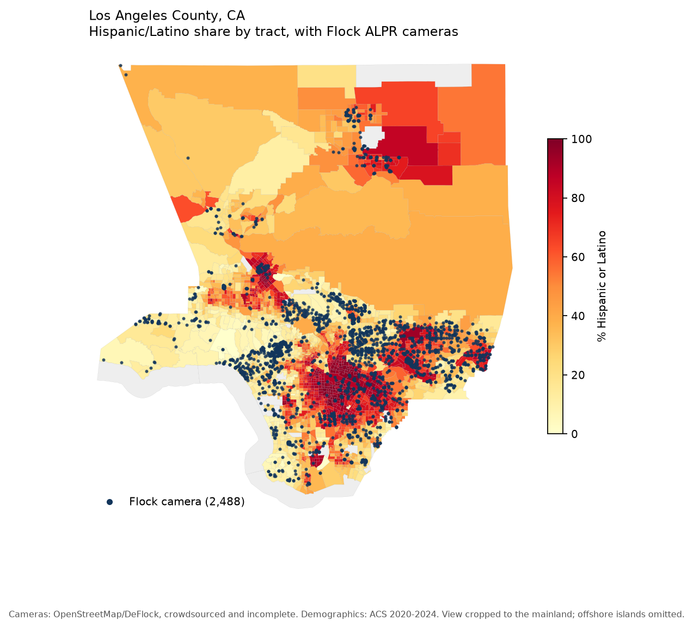
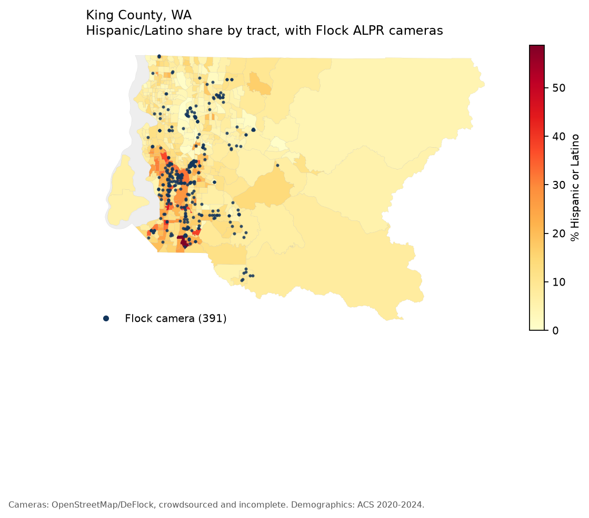
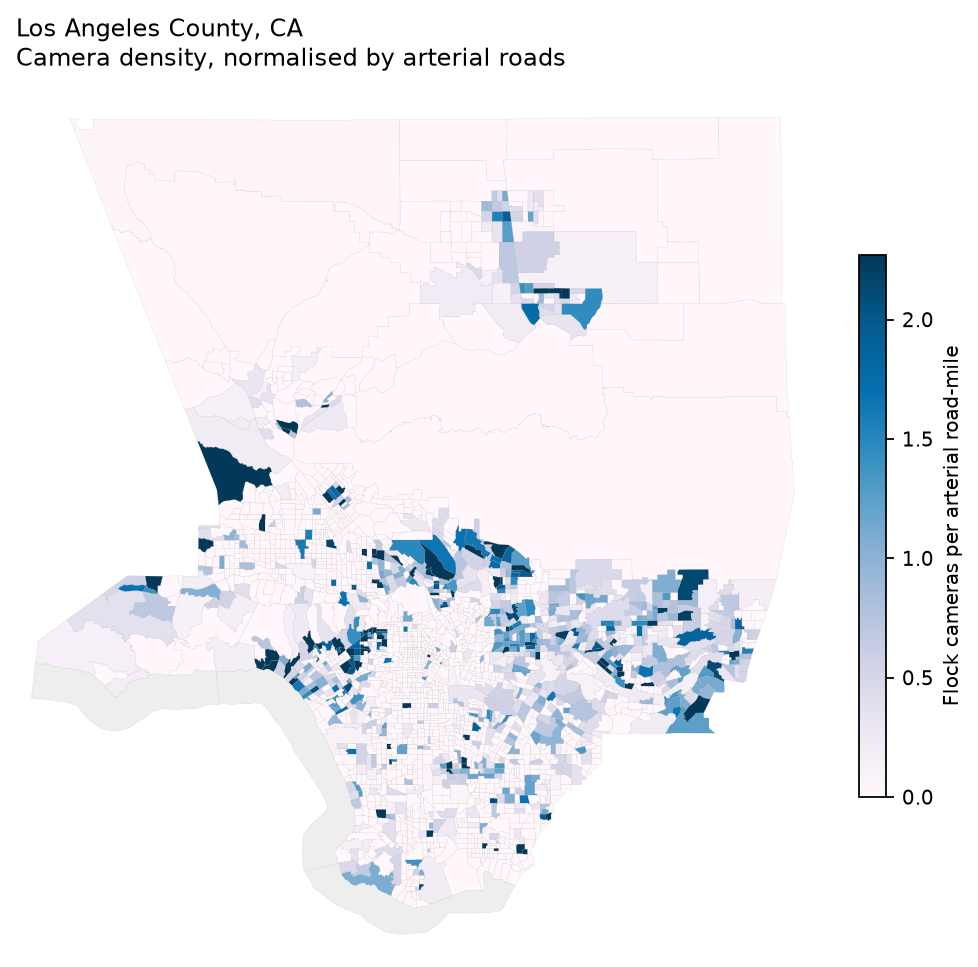
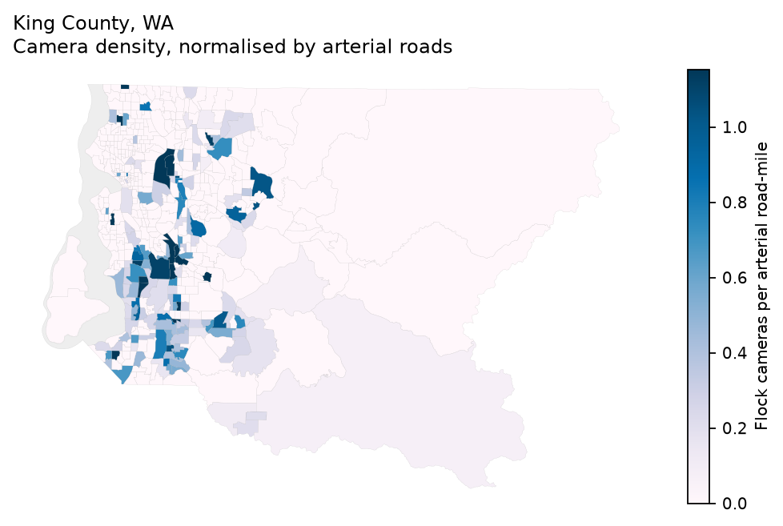
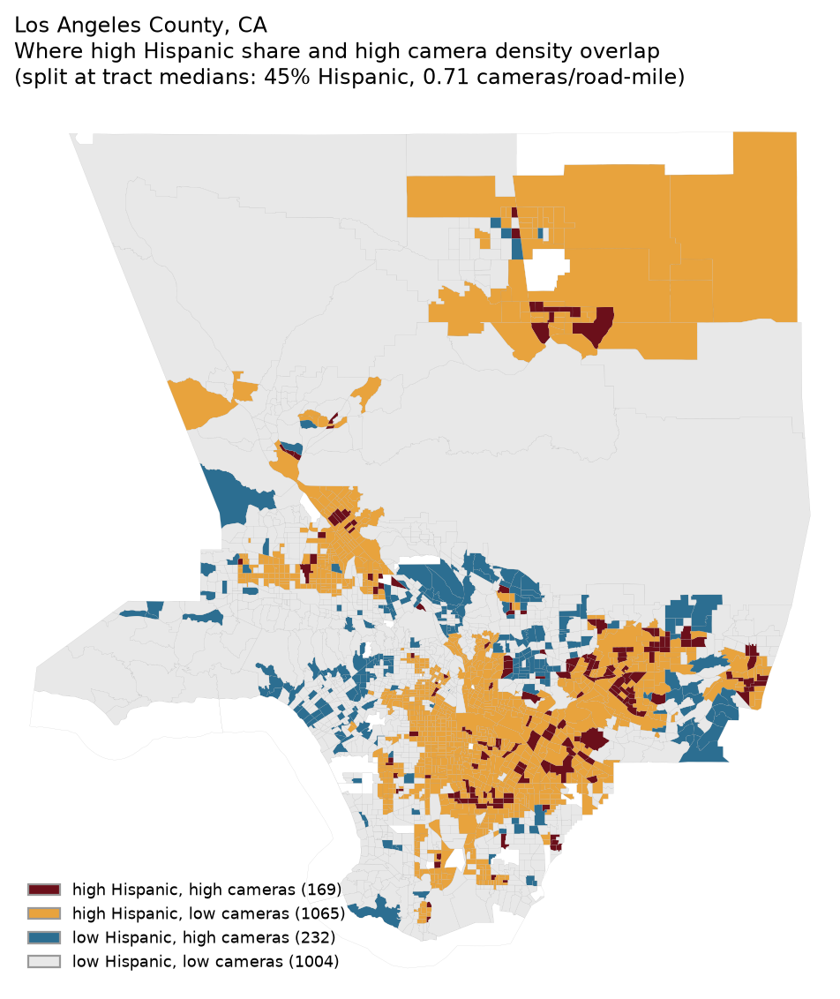
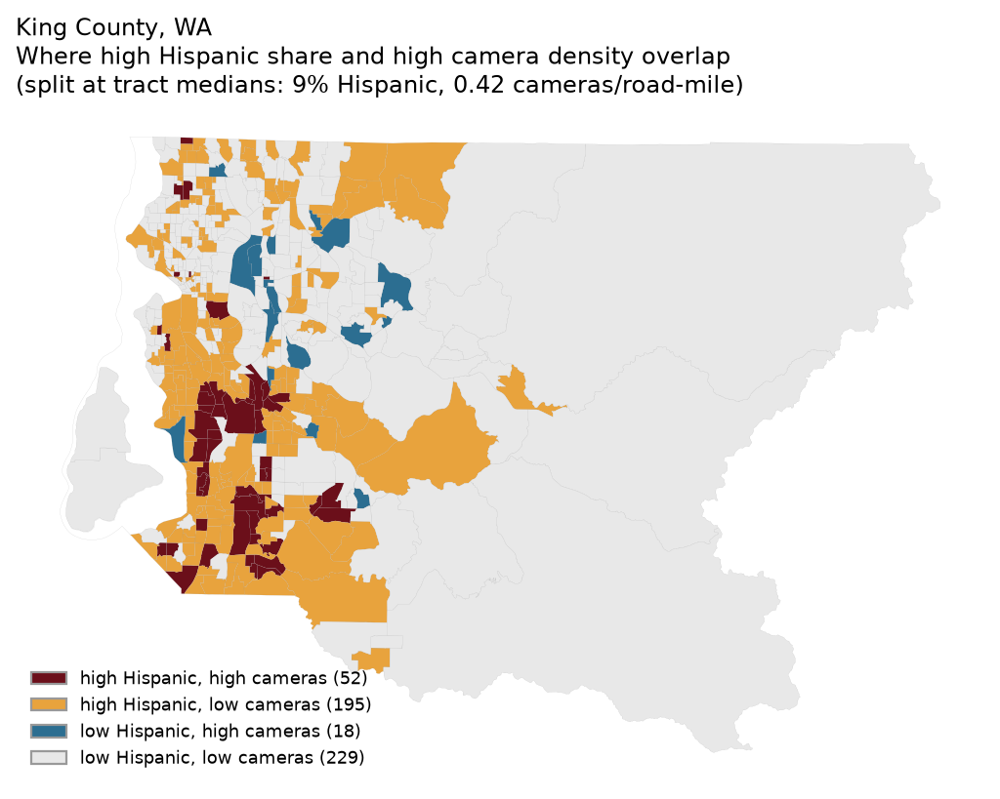
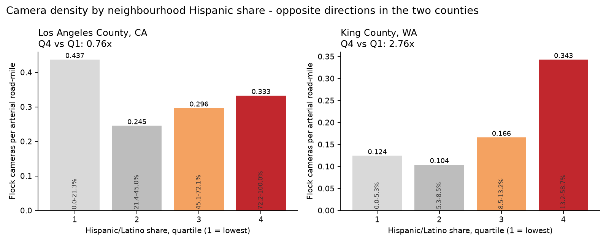
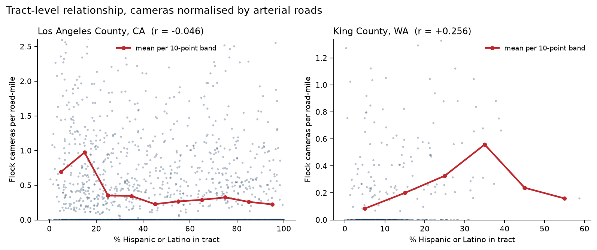
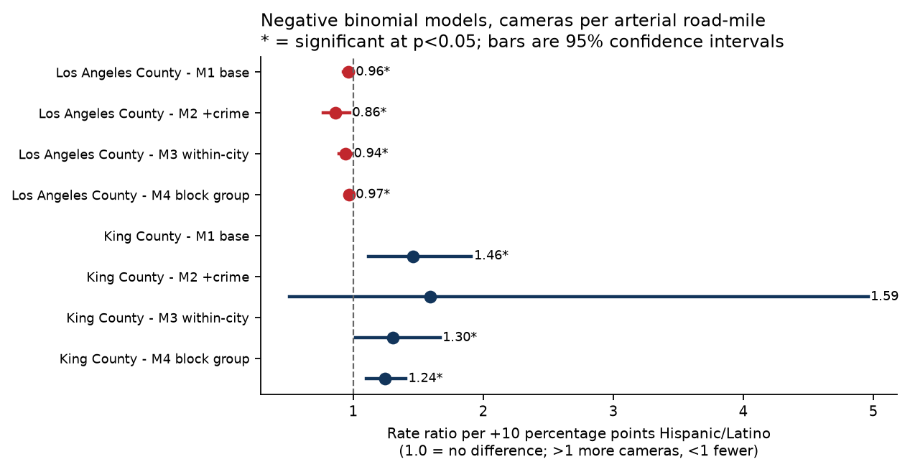
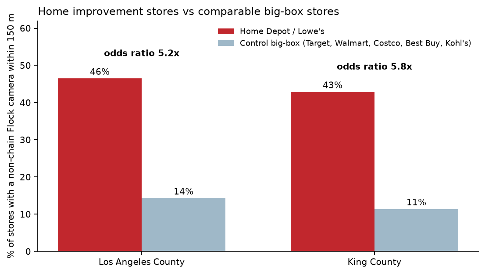

# Flock ALPR Camera Placement and Neighbourhood Demographics

### Los Angeles County, California and King County, Washington

**A spatial and statistical analysis of 3,025 mapped Flock automated license
plate readers against census demographics, road networks and reported crime.**

Analysis date: September 2026 · Camera data queried 2026-09-23 ·
Demographics: ACS 2020–2024 5-year estimates

---

## Summary

Flock Safety automated license plate readers (ALPRs) photograph every passing
vehicle, read its plate, and store the record in a searchable network shared
across agencies. This study asks whether those cameras are disproportionately
placed in Hispanic/Latino neighbourhoods, after accounting for the innocent
explanations — that cameras follow roads, population and crime.

Three findings:

1. **The two counties give opposite answers.** In King County, a tract 10
   percentage points more Hispanic has about **30% more cameras per arterial
   road-mile**, and the effect survives every control including comparing
   neighbourhoods within the same city. In Los Angeles County the same
   analysis finds **6% fewer**. There is no single national pattern visible
   here.
2. **Home improvement stores are the strongest signal in the data.** Home
   Depot and Lowe's are roughly **five times more likely** than comparable
   big-box retailers to have a Flock camera they do not own within 150 metres
   — 5.2x in LA (p<0.001), 5.8x in King County (p=0.010). These stores are the
   best-known informal day-labor hiring sites in both regions.
3. **Adoption is near-universal, so "which cities bought in" explains little.**
   81 of 88 LA cities and 25 of 31 King County cities have mapped cameras, and
   adopting cities are demographically indistinguishable from non-adopting
   ones.

The binding limitation throughout: camera locations are crowdsourced, therefore
incomplete, and the gaps are probably not random.

---

## 1. Research question

> Are Flock ALPR cameras placed disproportionately in Hispanic/Latino
> neighbourhoods, beyond what road density, population, income and reported
> crime would predict?

Two regions were chosen for contrast. Los Angeles County is 48% Hispanic with
9.8 million residents across 88 cities. King County is 11% Hispanic with 2.3
million across 38. If a placement pattern is a general feature of how Flock is
deployed, it should appear in both.

A secondary question follows from how Flock is sold. Systems are purchased city
by city, so a county-wide correlation could reflect **which governments bought
cameras** rather than **where a given government pointed them**. Both were
tested separately.

---

## 2. Data

| Dataset | Source | Records | Retrieved |
| --- | --- | --- | --- |
| Demographics | ACS 2020–2024 5-year, tables B03002, B01003, B19013 | 2,993 tracts; 8,136 block groups | 2026-09-23 |
| Boundaries, land area | TIGER/Line 2024 | same | 2026-09-23 |
| ALPR cameras | OpenStreetMap via Overpass (DeFlock project) | 4,229 ALPR; **3,025 Flock** | 2026-09-23 |
| Arterial roads | OpenStreetMap primary/secondary/tertiary | 10,359 road-miles | 2026-09-24 |
| Home Depot / Lowe's | OpenStreetMap | 92 stores | 2026-09-24 |
| Control retailers | OpenStreetMap (Target, Walmart, Costco, Best Buy, Kohl's) | 231 stores | 2026-09-27 |
| Reported crime | LAPD NIBRS; Seattle PD | 481,281 offences from 2025-01-01 | 2026-09-27 |
| City boundaries | TIGER/Line 2024 places | 88 LA cities; 38 King | 2026-09-27 |
| Day-labor candidates | NDLON map; City of LA; Casa Latina | 75, unverified | 2026-09-27 |

Full provenance, row counts and per-source limitations: `docs/data_sources.md`.

### How cameras are identified

DeFlock volunteers record ALPRs in OpenStreetMap as `man_made=surveillance` +
`surveillance:type=ALPR`, with the vendor in `manufacturer` or `brand` and the
owning agency in `operator`. This study queried **all** ALPR features rather
than Flock alone, so the Flock share is measured, not assumed: **72% of mapped
ALPRs in LA County and 69% in King County are Flock**.

Cameras were counted three ways, because they are not all the same kind of
object:

- **All ALPR** — every reader, any vendor.
- **All Flock** — 2,586 in LA, 439 in King.
- **Flock excluding retail operators** — removes the 98 LA and 48 King cameras
  operated by Home Depot and Lowe's themselves. **This is the outcome used in
  every model**, because a store's own camera is a private decision, not a
  government placement.

---

## 3. Method

### 3.1 Spatial processing

Everything was reprojected before any measurement: **EPSG:2229** (California
State Plane Zone 5) for LA, **EPSG:2285** (Washington North) for King County.
Both are in US survey feet, so lengths and distances are true rather than
degree approximations.

- Cameras, stores and crime incidents were assigned to tracts and block groups
  by point-in-polygon. Every camera matched a unit; none were dropped.
- Road lines were **split at unit boundaries** and the length inside each unit
  summed, rather than attributing a whole road to one tract.
- Each unit was assigned to the city containing its representative point;
  units in no incorporated place are unincorporated county.

### 3.2 Why cameras per road-mile

Raw camera counts would mostly measure how much road a tract contains. ALPRs
are mounted on poles beside traffic, so arterial road-miles are the natural
exposure measure. Arterial roads (`primary`, `secondary`, `tertiary` and their
link ramps) were used rather than all roads, because cameras are not placed on
residential cul-de-sacs.

### 3.3 The count model

Camera counts are overdispersed — most tracts have zero, a few have many — so
a **negative binomial** model was used rather than Poisson. Log arterial
road-miles enters as an **offset**, making the model predict cameras *per
road-mile*.

$$\log(E[\text{cameras}]) = \log(\text{road miles}) + \beta_0 + \beta_1 \cdot \text{pctHispanic}_{10} + \beta_2 \log(\text{pop}) + \beta_3 \text{income} + \beta_4 \text{density}$$

The main variable is scaled per 10 percentage points, so $e^{\beta_1}$ reads as
the multiplier on expected cameras for each 10-point increase in Hispanic
share.

Full maximum likelihood did not converge on the dispersion parameter (the
Hessian is singular at the optimum), so the standard two-step approach was
used: Poisson fit, then dispersion estimated by regressing scaled squared
residuals on the fitted mean (Cameron & Trivedi), then a GLM with that
dispersion held fixed and **heteroskedasticity-robust (HC1) standard errors**.

Four specifications per region:

| | What it adds | Why |
| --- | --- | --- |
| **M1 base** | population, income, density | the core estimate |
| **M2 + crime** | offences per 1,000 residents | tests the "cameras follow crime" explanation; only covers tracts inside the reporting city |
| **M3 within-city** | city fixed effects | compares neighbourhoods policed by the same agency, removing the purchasing decision |
| **M4 block group** | refit at finer geography | robustness to the unit of analysis |

### 3.4 Spatial dependence

Regression assumes independent observations, and tracts are not independent —
agencies deploy cameras in batches, so neighbouring tracts share outcomes.
Ignoring this understates standard errors and can manufacture significance.

**Moran's I** was computed on M1 residuals using queen-contiguity weights
(tracts sharing any boundary point are neighbours, row-standardised). Where
residual clustering was significant, a **spatial lag model** was fitted as a
cross-check. Because no spatial-lag negative binomial was available, the lag
model uses log(cameras + 1) as a continuous outcome; it tests direction and
significance, not magnitude.

### 3.5 City-level adoption

A separate dataset with one row per incorporated city: a logistic model for
whether the city has any non-retail Flock camera, and a negative binomial for
how many, again offset by road-miles.

### 3.6 The retailer test

For each Home Depot and Lowe's, whether a Flock camera the chain does not
operate sits within **150 metres**. Compared by Fisher's exact test against a
control group of big-box retailers (Target, Walmart, Costco, Best Buy, Kohl's)
— similar footprint, similar parking, similar arterial-road siting, but not
known day-labor hiring sites. Without that control group, a raw figure like
"82% of Home Depots have a camera nearby" is uninterpretable.

---

## 4. Results

### 4.1 Where the cameras are





Camera density, normalised by arterial roads, makes deployment intensity
visible independently of how much road a tract holds:





Splitting tracts at the median on both measures shows where the two overlap:





### 4.2 Raw comparison by quartile



| Quartile | LA: Hispanic share | LA: cameras/mile | King: Hispanic share | King: cameras/mile |
| --- | --- | --- | --- | --- |
| 1 (least) | 0–21% | 0.437 | 0–5% | 0.124 |
| 2 | 21–45% | 0.245 | 5–9% | 0.104 |
| 3 | 45–72% | 0.297 | 9–13% | 0.166 |
| 4 (most) | 72–100% | 0.333 | 13–59% | 0.343 |
| **Q4 ÷ Q1** | | **0.76x** | | **2.76x** |

Reported crime is nearly flat across LA quartiles (89–101 offences per 1,000
residents), so crime differences do not explain the LA pattern.

The tract-level relationship, with binned means through the scatter:



### 4.3 Models



Effect of each +10 percentage points Hispanic/Latino share on cameras per
road-mile:

| Model | LA County | p | King County | p |
| --- | --- | --- | --- | --- |
| M1 base | −4.2% | 0.040 | **+45.8%** | 0.006 |
| M2 + crime | −13.7% | 0.014 | +58.8% | 0.426 |
| **M3 within-city** | **−6.3%** | **0.008** | **+30.3%** | **0.035** |
| M4 block group | −3.1% | 0.035 | +24.2% | <0.001 |

**M3 is the specification that answers the question as asked.** By comparing
neighbourhoods policed by the same department, it isolates placement from
purchasing. King County's effect survives it; LA's stays slightly negative.

M2's King County estimate is not significant because it covers only 176 tracts
inside Seattle city limits — too small to conclude from, not evidence against.

### 4.4 Spatial dependence

| | Moran's I on residuals | p | Spatial lag coefficient | p | rho |
| --- | --- | --- | --- | --- | --- |
| LA County | 0.154 | 0.001 | −0.010 | 0.039 | 0.454 |
| King County | 0.142 | 0.001 | +0.133 | <0.001 | 0.398 |

Residuals are clustered in both counties, confirming that tracts are not
independent. Rho near 0.4 means a tract's camera count depends substantially on
its neighbours' — consistent with agency-level batch deployment. Directions and
significance survive the correction.

### 4.5 City adoption

| | Cities | With cameras | Mean Hispanic share, adopters | Non-adopters | Logistic odds ratio | p |
| --- | --- | --- | --- | --- | --- | --- |
| LA County | 88 | 81 | 44.9% | 46.8% | 0.96 | 0.842 |
| King County | 31 | 25 | 11.2% | 10.8% | 1.02 | 0.984 |

Adoption is near-universal and demographically flat. Camera *intensity* given
adoption rises with Hispanic share in King County (rate ratio 2.82 per 10
points, p=0.054, borderline) but not in LA (0.94, p=0.253).

The highest-density cities cut across demographics entirely:

| LA County | Hispanic | Cameras/mile | King County | Hispanic | Cameras/mile |
| --- | --- | --- | --- | --- | --- |
| West Hollywood | 13% | 3.22 | Yarrow Point | 3% | 1.60 |
| San Fernando | 92% | 2.40 | Medina | 0.3% | 1.27 |
| La Puente | 79% | 2.35 | SeaTac | 23% | 0.95 |
| Beverly Hills | 8% | 2.24 | Renton | 16% | 0.80 |
| Hawaiian Gardens | 76% | 2.11 | Tukwila | 26% | 0.77 |

Wealthy, overwhelmingly white municipalities (Beverly Hills, San Marino,
Medina, Yarrow Point) saturate themselves with ALPRs just as heavily as
working-class Latino cities (San Fernando, La Puente, Hawaiian Gardens). Any
account of ALPR proliferation has to explain both.

### 4.6 Retailer test



Cameras **not** operated by the store chain, within 150 m:

| | Home Depot / Lowe's | Control big-box | Odds ratio | Fisher p |
| --- | --- | --- | --- | --- |
| LA County | 46% of 71 | 14% of 196 | **5.21** | <0.001 |
| King County | 43% of 21 | 11% of 35 | **5.81** | 0.010 |

Nearly identical effect sizes in two counties with opposite tract-level
patterns. Including chain-owned cameras, 82% (LA) and 86% (King) of home
improvement stores have a Flock camera within 150 m.

The day-labor portion of this test — comparing stores that are hiring sites
against those that are not — **could not be run**. It requires verified sites;
`data/raw/day_labor_sites.csv` holds 74 unverified LA candidates and 1 for King
County, and no citable published list of Washington day-labor sites exists.

---

## 5. Limitations

**Crowdsourced camera data is the binding constraint.** DeFlock volunteers map
what they notice. Coverage likely varies with the density of privacy-minded
contributors, which plausibly correlates with income, education and urbanity.
If mapping is denser in wealthier areas, LA's negative coefficient could be an
artifact of who was looking rather than where cameras are. Nothing here can
rule that out, and only authoritative agency inventories would settle it.

**Operator information is mostly missing.** 86% of LA and 65% of King County
Flock cameras carry no `operator` tag, so government and private cameras cannot
be cleanly separated beyond the retail chains identified by name.

**Crime data covers cities, not counties.** LAPD polices 3.8M of LA County's
9.8M residents; SPD 750k of King County's 2.3M. Only 44% of LA and 36% of King
tracts have any crime data; the rest are recorded as missing, never zero.
Seattle additionally suppresses coordinates on 16% of records. Reported crime
also measures policing intensity, and police place the cameras — a feedback
loop no cross-section can untangle.

**Disparity is not intent.** Even a large, robust disparity would not show that
anyone chose locations because of who lives there. Cameras follow arterial
roads, commercial corridors, traffic volume and municipal budgets, all of which
correlate with demographics for reasons predating ALPR by decades.

**The two counties are not the same comparison.** "Most Hispanic quartile"
means 72–100% in LA and 13–59% in King. Contrast is far sharper in King County,
which may be why an effect is detectable there.

**ACS margins of error were not incorporated**, and they are widest in exactly
the small tracts where camera counts are most volatile.

**One snapshot**, queried 2026-09-23. No trend over time can be inferred.

---

## 6. Thesis

**The data does not support a general claim that Flock cameras are aimed at
Latino neighbourhoods, and it does not refute one. It supports something more
specific and, for the immigration-enforcement question, more consequential.**

Three claims the evidence carries:

**First, neighbourhood-level targeting is not a uniform phenomenon.** Two
counties, one method, opposite results. In King County the pattern is clear and
survives every control, including within-city comparison: more Hispanic
neighbourhoods have measurably more cameras per road-mile. In Los Angeles
County — the larger, far more Latino county, and the one with the most visible
immigration enforcement activity — the relationship is slightly negative.
Anyone asserting a nationwide targeting pattern has to explain LA. Anyone
denying any pattern has to explain King County.

**Second, the strongest signal is not about where people live but where they
look for work.** Home improvement stores carry roughly five times the odds of a
nearby non-chain ALPR compared to matched big-box retailers, and the effect
replicates almost exactly across two counties whose tract-level patterns point
in opposite directions. That consistency is what makes it notable: it is
unaffected by whatever local factors drive the divergent neighbourhood results.
Home Depot parking lots are the most recognised informal day-labor hiring sites
in the United States and have been the site of documented immigration
enforcement operations. This analysis cannot say who installed those cameras or
why, and tool theft and contractor traffic are genuine alternative
explanations. It can say the concentration is real, large and geographically
consistent.

**Third, the purchasing story is not a demographic story.** Flock adoption is
near-universal among municipalities in both counties, and the cities with the
densest camera coverage include some of the whitest and wealthiest in America.
Surveillance infrastructure is not being bought only by, or only for, places
with large immigrant populations. It is being bought nearly everywhere — which
means the relevant question shifts away from who installs cameras and toward
**who can query the resulting network**.

That last point is where this analysis reaches its limit and hands off. A
camera's coordinates cannot tell you who searches its records. Whether a
Hispanic neighbourhood is over- or under-covered matters less if every network
is queryable by agencies far outside the jurisdiction that installed it. That
question is documentary rather than spatial, and it is what the document-search
component of this project (Phase 6) addresses: the record of federal and
immigration-agency access to Flock data, including the University of Washington
Center for Human Rights findings on federal access to Washington state Flock
systems.

**The honest summary:** placement disparity exists in one of two counties
studied and points the other way in the other; proximity to day-labor hiring
sites is the robust spatial finding; and the surveillance network is broad
enough that access policy, not placement, is where the immigration-enforcement
risk concentrates.

---

## 7. Reproducing this

```bash
python3.13 -m venv .venv && source .venv/bin/activate
pip install -r requirements.txt
cp .env.example .env          # add a Census API key

python src/collect/census_acs.py
python src/collect/tiger_boundaries.py
python src/collect/tiger_places.py
python src/collect/flock_cameras.py
python src/collect/osm_roads.py
python src/collect/osm_retailers.py
python src/collect/osm_control_retailers.py
python src/collect/crime.py
python src/collect/day_labor_sites.py

python src/analysis/build_units.py
python src/analysis/descriptive.py
python src/analysis/models.py
python src/analysis/city_adoption.py
python src/analysis/retailer_test.py
python src/analysis/make_maps.py
python src/analysis/make_figures.py
```

OpenStreetMap and crime datasets change continuously, so re-running will give
different counts. Camera figures in this report are the 2026-09-23 snapshot.

**Outputs:** result tables in `outputs/tables/`, figures in `outputs/figures/`,
interactive maps in `outputs/maps/`, analysis database at
`data/processed/flock.duckdb`.
